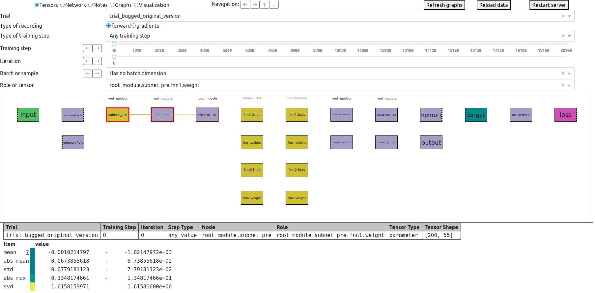
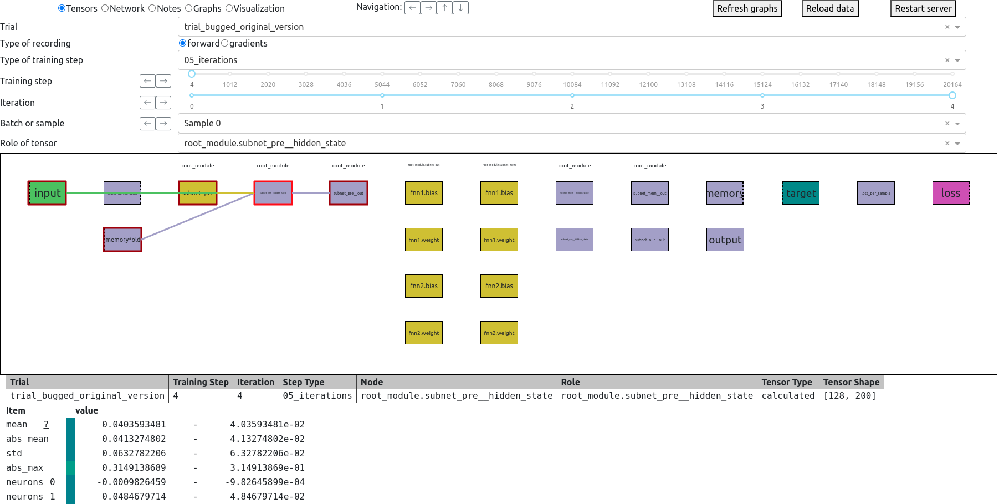
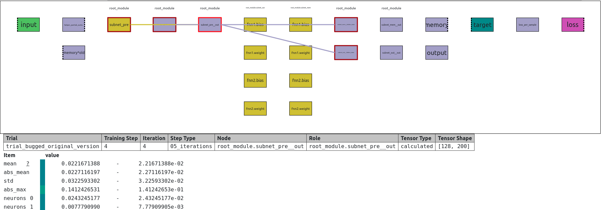
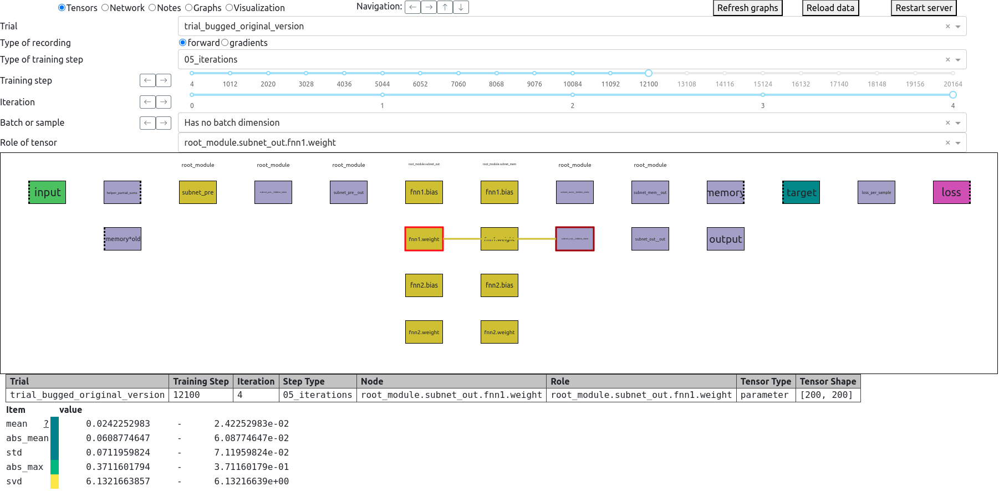

# Comgra: Computation Graph Analysis

<p align="center">

</p>

- [Overview](#overview)
- [Installation](#installation)
- [Usage](#usage)
- [Tutorial](#tutorial---debugging-an-example-network)
  - [The task and the architecture](#the-task-and-the-architecture)
  - [Initial exploration](#initial-exploration)
  - [Finding the bug](#finding-the-bug)
- [Other features](#other-features)
- [Future Development](#future-development)

## Overview

Comgra helps you analyze and debug neural networks in pytorch.  
It records your network internals, visualizes the computation graph, and provides a GUI to investigate any part of your network from a variety of viewpoints.  
Move along the computation graph, check for outliers, investigate both individual data points and summary statistics, compare gradients, automatically record special cases, and more.

Comgra is complementary to tensorboard:  
Use Tensorboard to get an overview of what is happening at a high level.  
Use Comgra to deep dive into your neural network: Comgra records everything that could be relevant to you, and allows you to inspect your network's behavior from many different angles.

Suitable both for novices and for professional neural architecture designers: Create a simple visualization of your network to understand what is happening under the hood, or perform advanced analyses and trace anomalies through the computation graph.


Comgra's GUI has three parts:
* A dependency graph that visualizes how the tensors in your network depend on each other
* Selectors that let you choose under what lens you want to inspect the tensors
* An output that lists both summary statistics and the values of individual neurons for the selected tensors
<details>
  <summary><b>Notes on the dependency graph</b></summary>

  Each rectangle in the dependency graph is a node that represents a named tensor. The colors indicate the roles of the tensor in the network, such as input, intermediate, parameter, etc.

  The dependency graph is generated automatically based on the computation graph used by pytorch and the names you assign to tensors through comgra. It is a subgraph of the computation graph, but it is much easier to understand because it is smaller and skips all of the distracting details.

  This cutting away of details also makes it easier to compare different variants of architectures: Their computation graphs may look different, but the simplified dependency graphs are the same.
</details>

## Installation

Install with pip:

```bash
pip install comgra
```

## Usage

To use comgra, modify your python code with the following commands in the appropriate places. This may look daunting, but most of it really just tells comgra what you are currently doing so that it knows how to associate the tensors you register. The file `src/scripts/run.py` contains a documented example that you can copy and will be explained in detail below.

```python
import comgra
from comgra.recorder import ComgraRecorder
# Define a recorder
comgra.my_recorder = ComgraRecorder(...)
# Track your network parameters
comgra.my_recorder.track_module(...)
# Optionally, add some notes for debugging
comgra.my_recorder.add_note(...)
# Call this whenever you start a new training step you want to record:
comgra.my_recorder.start_next_recording(...)
# Call this whenever you start the forward pass of an iteration. In multi-iteration experiments, call it once per iteration:
comgra.my_recorder.start_forward_pass(...)
# Register any tensors you care about:
comgra.my_recorder.register_tensor(...)
# Call these whenever you apply losses and propagate gradients:
comgra.my_recorder.start_backward_pass()
comgra.my_recorder.record_current_gradients(...)
# Call this whenever you end an iteration:
comgra.my_recorder.finish_iteration()
# Call this whenever you end a training step:
comgra.my_recorder.finish_batch()
```

When your code runs, comgra will store data in the folder you specified with `ComgraRecorder(comgra_root_path="/my/path/for/storing/data", group="name_of_experiment_group")`.  
In the process, it will automatically organize everything, extract statistics, and build the dependency graph.

To start the GUI and visualize your results, run
```bash
comgra --path "/my/path/for/storing/data/name_of_experiment_group"
```

Note that --path should include both the "comgra_root_path" and the "group" parameter you gave to ComgraRecorder.


## Tutorial - Debugging an example network

The file `src/scripts/run.py` trains a neural network on an example task. This network contains a subtle bug, and in this tutorial we will show how you can use comgra to find that bug.

For convenience, you can run the file from the commandline using
```bash
comgra-test-run
```

and you can start the GUI on the data it generates by calling
```bash
comgra --use-path-for-test-run
```

### The task and the architecture

We use a synthetic task that is designed to test a neural network's ability to generalize to longer sequences while being very simple and human-interpretable.  
The input is a sequence of N tuples of 5 numbers between 0.0 and 1.0. The network should treat these as 5 separate sequences. Its objective is to determine which of these 5 sequences has the largest sum.

Our architecture is a simple recurrent neural network that is composed of some submodules. It's nothing fancy, but illustrates how comgra can be integrated into an architecture.  
We run two variants of the architecture. The original variant contains a bug, which we will discover later in this section of the Readme. For convenience we run both trials in one script, but in a real use case the second variant would have been implemented and run later, after finding the bug. In the GUI, you can switch between the two variants with the 'Trial' selector.

### Initial exploration

As a first step, let's look at network summary information and the notes created by the script. To do so, select "Network" and "Notes" respectively at the main radio button at the top left of the screen.

<details>
  <summary><b>Sreenshot of notes</b></summary>
  
</details>

The Notes tab shows anything that we decided to log in our script, such as the loss and accuracy values. If we scroll down, we see that performance improves, but it does not look very good. Let's use comgra to investigate our architecture and see if we can find a reason for our poor performance.

(In practice, information about loss and performance over time can be better visualized with other tools, such as Tensorboard, but since this tutorial should run standalone we put the information in the logs instead.)

Let's see if we can already find a problem at a high level, by clicking the "Network" button.

<details>
  <summary><b>Screenshot of network info</b></summary>
  
</details>

The Network tab shows a recursive breakdown of all network parameters, in tree form. We can see that none of the submodules has such a small number of parameters that it could form a bottleneck, which rules out one kind of bug.

Next, let's click the "Tensors" button and start the main analysis.

<details>
  <summary><b>Examples and screenshots: Walking through the computation graph</b></summary>
  When you start comgra, the screen should look like this.

  

  Let's start by setting some selectors to some arbitrary but sensible values to get an initial overview:  

  * Set the "Type of training Step" to "05_iterations" so that we are only shown training steps that ran for exactly 5 iterations.
  * Select the last iteration: Note that the Node for the Loss only appears in the computational graph if the last iterayion is selected, because a loss is only applied on the last iteration.
  * Set "Batch or sample" to "batch index 0": The values at the bottom of the screen now show the values for only the first element of the batch. This makes it possible to investigate how the network reacts to specific examples, while "Mean over the batch" is more useful for investigating how statistics change over time. Note that the values "mean", "abs_mean", "std", and "abs_max" at the bottom of the screen are statistics over the value dimension of the tensor. Setting "Batch or sample" to "Mean over the batch" means that it additionally calculates the mean over the batch dimension after calculating the statistic over the value dimension. This combination gives you a lot of flexibility in how you look at the data.
  

  We have currently selected the "input" node in the dependency graph (the green node in the top left). The lines that go from the selected node to other nodes indicate dependencies. In the following we move along the dependency graph by clicking on subsequent nodes until we get to the "Loss" node.

  
  
  
  
  
  

  Note how the values displayed at the bottom update immediately whenever you select a new node, or change a selector. This allows you to investigate many different hypotheses quickly, without waiting for results or having to restart your experiment.

  Next, we investigate if the network parameters show any suspicious behavior. To do so, we select a node that represents a network parameter and move the slider for the training step.

  
  
  
  
  
  
  

  Judging by the way abs_mean and abs_max change over the course of training, the network parameters specialize and become more extreme, but they do not explode. This looks like healthy behavior.
</details>

The best way to get a feel for the GUI is to try it yourself. There is a lot of basic information that is helpful to investigate, both as a sanity check and to get a better intuitive feel for your network's internals. Try the following:

* Look at the inputs, outputs and targets for different batch indices and at different training steps. Is the target what it should be? Does the output approximate it well? Do intermediate tensors all have the same value range, or are some of them larger or smaller than others? Can you notice any irregularities when you compare different batches?
* So far we have only looked at the tensors produced by the network, but there is also a selector to look at the gradients on the tensors instead. Check the gradients on some tensors. Do they point in the right direction? Does it look like the gradients are ever too larger or too small? Comgra makes it easy to find vanishing or exploding gradients, and to pinpoint at which node in the computation graph the problem starts.
* In our example script, we defined a node called "helper_partial_sums", which can be found to the top right of the dependency graph, below the target. Unlike other nodes, this node contains several different tensors with different roles, and you can switch between them using the "Role of tensor" selector. We use this feature here to store helper values for debugging, because the partial sums are relevant for solving the task but wouldn't normally get stored by the network, so it is convenient to make them available in the GUI. Note that the "Role of tensor" feature is also useful if you are working with self-attention or another mechanism that can work on a variable number of tensors.

All of these explorative analyses are easy and fast to do, so they are often worth the time. They can easily save you hours or days of frustration by catching a simple mistake early. Even if you find no mistakes, they can still be helpful to get a better understanding of your network's behavior.

### Finding the bug

As we noticed before, the code works, but not very well.

If you paid careful attention during the explorative analysis you may have noticed something odd:  
The neurons of the output tensor should be either 1 or 0. While values close to 1 are reached early in training, values close to 0 are reached only very late. If we look at the mean over the batch, the values are much greater than expected, too.

Why could this be?

If we look at the tensor immediately preceding the output in the dependency graph ("subnet_out__out"), we notice that its positive values are much higher than its negative values. This is a problem, because that's the tensor we put into our sigmoid activation function!

From here on, we jump into our code to find out what's going on. If the source of the problem is not clear to you, then it can help to just register more intermediate tensors with comgra and run the experiment again, inspecting both the values and the gradients on each tensor. If you have seen this sort of behavior before you may find the culprit immediately: Our subnetworks use an activation function, leaky_relu with a negative slope of 0.01, and they apply this activation at every layer, including the last one.

This means that while our submodules can produce negative outputs, they learn to do so at only 1% of the rate they should.

We have found the source of the bug.

In the `src/scripts/run.py` script we also run a second trial in which this bug is fixed: We simply skip the activation function on the last layer of submodules.

The results of this can be seen by switching the "Trial" selector from "trial_bugged_original_version" to "no_activation_function_on_output_layer".

If you inspect this second trial, you will notice that the bug is gone and performance has improved by a lot. In particular, OOD accuracy at a length of 20 ierations went from 0.586 to 0.859 in our local trials.

This was the sort of bug that harmed performance but still allowed the network to solve the task. Without the inspection abilities offered by comgra, it would normally be next to impossible to detect a bug like this.

## Other features

Comgra gives you a lot of different ways to look at your data. Here are some suggestions for what you can do with it:

* Go through toy examples step-by-step. This is normally time-consuming and often not worth it, but comgra makes it easy.
* Rapidly check if any parameters or intermediate results misbehave: Extreme values are always suspicious. High STD over the batch may indicate divergence, while low STD may indicate mode collapse.
* Use the type_of_execution parameter to ensure that rarely occurring special cases still get recorded regularly and are easy to find. You can also use it to mark inputs with specific properties you are interested in. For example, to mark especially simple or especially hard inputs, or inputs with extreme outlier values.
* Check for anomalous gradients. Do any of your activation functions unexpectedly kill gradients? Are you using attention mechanisms with extreme weights that drive down the gradients? Are gradients non-zero, but with wildly different magnitudes in different parts of the network or under different circumstances? 
* Trace NaNs and Extreme Values. Where did the anomalous value come from? Just find the first training step where any tensor is NaN or abs().mean() is extreme. Then find out why this may be, by looking at the gradients on that step and previous ones.
* Check if network initialization is sensible. What do tensors and their gradients look like on the very first training steps? Do their means change significantly? If so, this suggests that the initialization can be improved.
* Check a tensor's variance over the batch dimension. If this decreases, we may have mode collapse. If it increases unboundedly, it suggests that a tensor is receiving consistently one-directional gradients that makes the tensor more and more extreme over time, instead of approximating a target value more accurately.
* Challenge your intuition. Sometimes the network acts differently than you would intuitively expect. In one concrete case that happened to me, I was interpolating a tensor as y=a*w+b*(1-w) and was surprised to see that the value for "a" received a gradient pushing it away from the target value of y. This actually made mathematical sense for the values I had (a=1.1, b=0.1, w=0.5, target of y = 1), but it was not intuitive to me. Comgra enabled me to notice this discrepancy between my intuition and the network's actual behavior, and that allowed me to improve the network. I have encountered several cases like these, where my intuition about the optimal learned attention weights was way off from what was actually learned on a toy task, which taught me a lot about the network dynamics.
* Check if any neurons end up with interpretable values. For example, the weights in attention mechanisms tell you what the network pays attention to. But there are also more subtle interpretable values that would be difficult to inspect without comgra, unless you already know what to look for ahead of time, before you run the experiment. For example, you can compare the mean absolute values of the two branches in a residual connection to find out if the network ignores a calculation and relies on residuals.


## Future Development


A goal for the future development of this tool is the automated detection of anomalies in computational graphs.

It should be possible to define anomalies like "Tensor X has a greater absolute value than 1" or the like, and then have the program automatically calculate likely dependencies such as this:

The anomaly "abnormally high loss" has 87% correlation with the anomaly "Tensor 5 is close to zero".

This would save a lot of time with debugging, by automatically generating a list of possible reasons for unexpected behavior.

Anomalies could be defined in many different ways, and standard tools for causality analysis already exist. If you are interested in a feature like this and/or want to help, please let me know at floriandietz44@gmail.com

