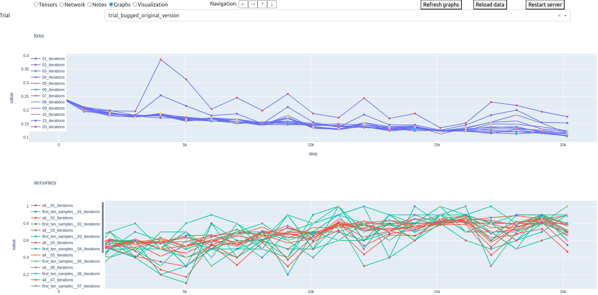
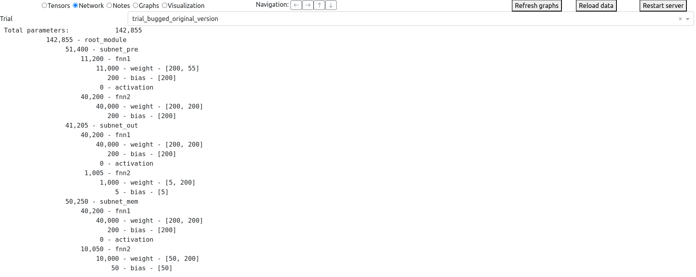
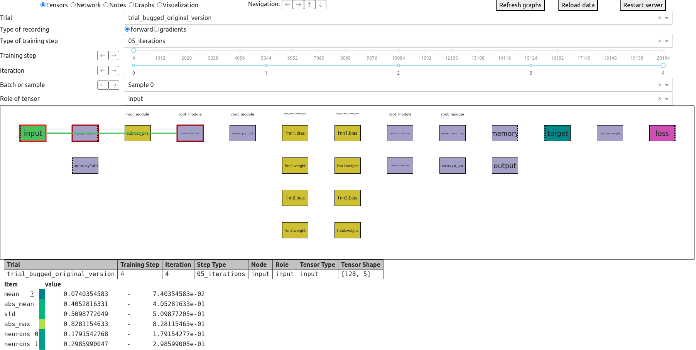
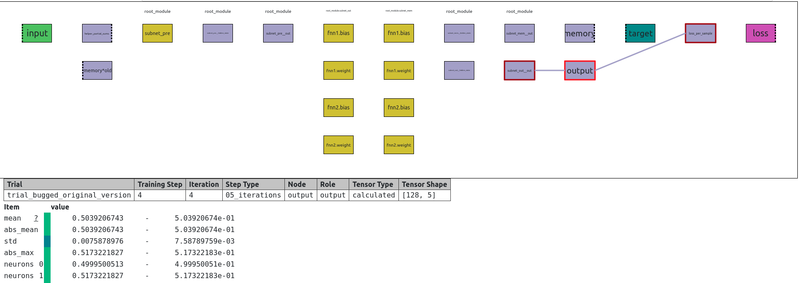
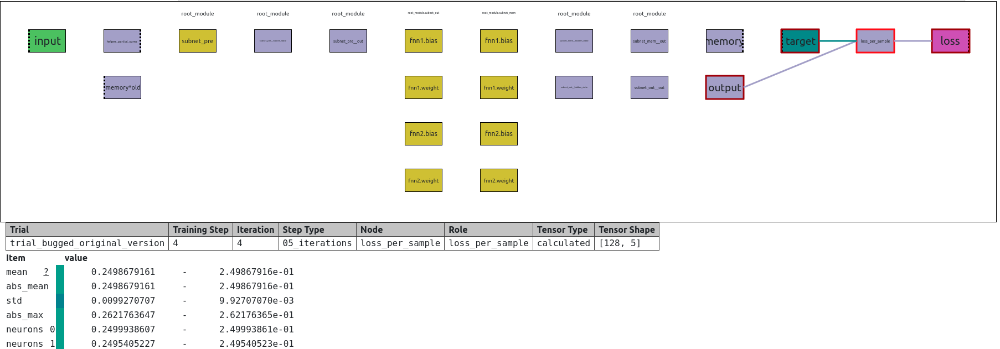

# Comgra: Computation Graph Analysis

<p align="center">

</p>

- [Overview](#overview)
- [Installation](#installation)
- [Usage](#usage)
- [Tutorial](#tutorial---debugging-an-example-network)
  - [The Task and the Architecture](#the-task-and-the-architecture)
  - [Initial Exploration](#initial-exploration)
  - [Finding the Bug](#finding-the-bug)
- [Other Features](#other-features)
- [Custom Visualization](#custom-visualization)
- [Dynamic Recordings](#dynamic-recordings)
- [Known Issues](#known-issues)
- [Future Development: Anomaly Detection and Correlation Analysis](#future-development-anomaly-detection-and-correlation-analysis)

## Overview

Comgra helps you analyze and debug neural networks in pytorch.  
It records your network internals, visualizes the computation graph, and provides a GUI to investigate any part of your network from a variety of viewpoints.  
Move along the computation graph, check for outliers, investigate both individual data points and summary statistics, compare gradients, automatically record special cases, and more.
Comgra records everything that could be relevant to you, and allows you to inspect your network's behavior from many different angles.

Suitable both for novices and for professional neural architecture designers: Create a simple visualization of your network to understand what is happening under the hood, or perform advanced analyses and trace anomalies through the computation graph.

| 
| -

Comgra's GUI has three parts:
* A dependency graph that visualizes how the tensors in your network depend on each other
* Selectors that let you choose under what lens you want to inspect the tensors
* An output that lists both summary statistics and the values of individual neurons for the selected tensors
<details>
  <summary><b>Notes on the dependency graph</b></summary>

  Each rectangle in the dependency graph is a node that represents a named tensor. The colors indicate the roles of the tensor in the network, such as input, intermediate result, parameter, etc.

  When you select a node it becomes highlighted, along with all nodes that it depends on (to the left) and that depend on it (to the right). Only the links for the selected node are shown by default to avoid visual clutter, but by clicking on one node after the other you can explore the entire dependency graph.
  
  If a node has a dotted border on one side, it indicates that it does not have any dependency (left) or dependent (right) on that iteration. If a connection is drawn with a thinner line, it indicates that some of the tensors in the node have this connection, but the currently selected one does not. In the example network of the tutorial, this is the case for the node 'subnet_pre', which summarizes all four parameters of the module with that name. You can use the "Role of Tensor" selector to switch to another parameter in that module, which will change the connections.

  The dependency graph is generated automatically based on the computation graph used by pytorch and the names you assign to tensors through comgra. It is a subgraph of the computation graph, but it is much easier to understand because it is smaller and skips all the distracting details.

  This cutting away of details also makes it easier to compare different variants of architectures: Their computation graphs may look different, but the simplified dependency graphs are the same.
</details>

## Installation

Install with pip:

```bash
pip install comgra
```

## Usage

To use comgra, modify your python code with the following commands in the appropriate places. Most of it just tells comgra what you are currently doing so that it knows how to associate the tensors you register. The file `src/scripts/run.py` ([found here](https://github.com/FlorianDietz/comgra/blob/main/src/scripts/run.py)) contains a documented example that you can copy and that will be explained in detail below.

```python
import comgra
from comgra.recorder import ComgraRecorder
# Define a recorder
comgra.my_recorder = ComgraRecorder(...)
# Track your network parameters
comgra.my_recorder.track_module(...)
# Optionally, add some notes for debugging
comgra.my_recorder.add_note(...)
# Optionally, record KPIs (like Tensorboard)
comgra.my_recorder.record_kpi_in_graph()
# Call this whenever you start a new training step you want to record.
# Each training step may be composed of multiple iterations.
comgra.my_recorder.start_batch(...)
# Call this whenever you start the forward pass of an iteration:
comgra.my_recorder.start_iteration(...)
# Register any tensors you may want to investigate:
comgra.my_recorder.register_tensor(...)
# Create some additional, optional connections for cases where the
# computation graph does not fully reflect the connections you want to see,
# e.g. because of detach() commands or non-differentiable dependencies.
comgra.my_recorder.add_tensor_connection(...)
# Call these whenever you apply losses and propagate gradients:
comgra.my_recorder.record_current_gradients(...)
# Call this whenever you end an iteration:
comgra.my_recorder.finish_iteration()
# Call this whenever you end a training step:
comgra.my_recorder.finish_batch()
# Call this when you are done
comgra.my_recorder.finalize()
```

Not all of these commands are necessary. The following is a minimal example. You can [run it directly on Colab](https://colab.research.google.com/drive/1RuMHlv_pp1_t_tkZfojV0LVR-Zo7QoVv?usp=sharing)

```python
import torch
import torch.nn as nn
import torch.optim as optim
import comgra
from comgra.objects import DecisionMakerForRecordingsFrequencyPerType
from comgra.recorder import ComgraRecorder

# Define a simple model
class SimpleModel(nn.Module):
    def __init__(self):
        super(SimpleModel, self).__init__()
        self.layer0 = nn.Linear(5, 5)
        self.layer1 = nn.Linear(5, 5)

    def forward(self, x):
        x = self.layer0(x)
        return self.layer1(x)

# Initialize comgra
comgra.my_recorder = ComgraRecorder(
    comgra_root_path="/my/path/for/storing/data",
    group="name_of_experiment_group",
    trial_id="example_trial",
    decision_maker_for_recordings=DecisionMakerForRecordingsFrequencyPerType(min_training_steps_difference=10),
)
comgra.my_recorder.add_note("This is an optional log message that will show up in the 'Notes' tab.")

# Create model, loss function, and optimizer
model = SimpleModel()
criterion = nn.MSELoss()
optimizer = optim.SGD(model.parameters(), lr=0.01)
comgra.my_recorder.track_module("main_model", model)

# Generate some dummy data
inputs = torch.randn(100, 5)
targets = 2 * inputs + torch.randn(100, 5) * 0.1

# Training loop
num_epochs = 100
for epoch in range(num_epochs):
    comgra.my_recorder.start_batch(epoch, inputs.shape[0])
    comgra.my_recorder.start_iteration()
    # Forward
    comgra.my_recorder.register_tensor("inputs", inputs, is_input=True)
    outputs = model(inputs)
    comgra.my_recorder.register_tensor("outputs", outputs)
    comgra.my_recorder.register_tensor("targets", targets, is_target=True)
    loss = criterion(outputs, targets)
    comgra.my_recorder.register_tensor("loss", loss, is_loss=True)
    comgra.my_recorder.record_kpi_in_graph("loss", "", loss)
    # Backward
    optimizer.zero_grad()
    loss.backward()
    optimizer.step()
    comgra.my_recorder.record_current_gradients(f"gradients")
    comgra.my_recorder.finish_iteration()
    comgra.my_recorder.finish_batch()
comgra.my_recorder.finalize()
```

When your code runs, comgra will store data in the folder you specified with `ComgraRecorder(comgra_root_path="/my/path/for/storing/data", group="name_of_experiment_group")`.  
In the process, it will automatically organize everything, extract statistics, and build the dependency graph.

To start the GUI and visualize your results, run
```bash
comgra --path "/my/path/for/storing/data/name_of_experiment_group"
```

Note that "--path" should include both the "comgra_root_path" and the "group" parameter you gave to ComgraRecorder. You can start the GUI while the script is still running and it will automatically load new data as it becomes available.


## Tutorial - Debugging an Example Network

The file `src/scripts/run.py` ([found here](https://github.com/FlorianDietz/comgra/blob/main/src/scripts/run.py)) trains a neural network on an example task. This network contains a subtle bug, and in this tutorial we will show you how you can use comgra to find that bug.

For convenience, you can run the file from the commandline using
```bash
comgra-test-run
```

The results of that run will be stored in a local folder of the library. You can start the GUI on this data by running

```bash
comgra --use-path-for-test-run
```

You can also [check out the GUI on Colab](https://colab.research.google.com/drive/15PEZjxFG6CVTewHBXidTXMsM6CCQM6kC?usp=sharing), with pre-generated data.


### The Task and the Architecture

We use a synthetic task that is designed to test a neural network's ability to generalize to longer sequences, while being very simple and human-interpretable. The input is a sequence of N tuples of 5 numbers between -1.0 and 1.0. The network should treat these as 5 separate, independent sequences. Its objective is to sum up each of the sequences and decide if their sum is positive. The target consists of 5 numbers, one for each sequence, which is a 1 if the sum is positive and a 0 otherwise. 

Our architecture is a simple recurrent neural network that is composed of three submodules. It's nothing fancy, but illustrates how comgra can be integrated into an architecture.

We run two variants of the architecture. The original variant contains a bug, which we will discover later in this section of the Readme. For convenience, we run both trials in one script, but in a real use case the second variant would have been implemented and run later, after finding the bug. In the GUI, you can switch between the two variants with the 'Trial' selector.

### Initial Exploration

As a first step, let's look at network summary information, graphs, and the notes created by the script. To do so, select "Network" and "Notes" respectively at the main radio button at the top left of the screen.

| 
| -

The Notes tab shows anything that we logged with `add_note()`. If we scroll down, we see that performance improves, but it does not look very good.

| 
| -

The Graphs tab shows KPIs we logged with `record_kpi_in_graph()`. This visualization is based on plotly and is interactive, similar to tensorboard. We can see that the loss only converges slowly and that the network generalizes poorly: The curves for 15 iterations and 20 iterations, which are only used during testing, are much higher than the rest.

| 
| -

The Network tab shows a recursive breakdown of all network parameters, in tree form. We can see that none of the submodules has such a small number of parameters that it could form a bottleneck, which rules out one kind of bug.

There is also a "Visualization" tab. This is an advanced feature described under [Custom Visualization](#custom-visualization). It is not relevant for this tutorial.

Next, let's click the "Tensors" button and start the main analysis.

| 
| -

Let's start by setting some selectors to some arbitrary but sensible values to get an initial overview:  

* Set the "Type of training Step" to "05_iterations" so that we are only shown training steps that ran for exactly 5 iterations.
* Select the last iteration: Note that the Node for the Loss only appears in the computational graph if the last iteration is selected, because a loss is only applied on the last iteration.
* Select the "input" node.
* Set "Batch or sample" to "Sample 0": The values at the bottom of the screen now show the values for only the first element of the batch. This makes it possible to investigate how the network reacts to specific examples, while "Mean over the batch" is more useful for investigating how statistics change over time. Note that the values "mean", "abs_mean", "std", and "abs_max" at the bottom of the screen are statistics over the value dimension of the tensor. Setting "Batch or sample" to "Mean over the batch" means that it additionally calculates the mean over the batch dimension after calculating the statistic over the value dimension. This combination gives you a lot of flexibility in how you look at the data.

| 
| -

We have currently selected the "input" node in the dependency graph (the green node at the top left). The lines that go from the selected node to other nodes indicate dependencies. In the following we move along the dependency graph by clicking on subsequent nodes until we get to the "Loss" node. (Note that a different node is highlighted in each image).

<details>
  <summary><b>Click here to expand: Walking through the dependency graph</b></summary>

  | 
  | -

  | 
  | -

  | 
  | -
  
  | 
  | -

  | 
  | -

  | 
  | -

  | 
  | -
</details>

Note how the values displayed at the bottom update immediately whenever you select a new node, or change a selector. This allows you to investigate many different hypotheses quickly, without waiting for results or having to restart your experiment.

Next, we investigate if the network parameters show any suspicious behavior. To do so, we select a node that represents a network parameter and move the slider for the training step.

<details>
  <summary><b>Click here to expand: Varying the training step</b></summary>

  | 
  | -

  | 
  | -

  | 
  | -

  | 
  | -
</details>

Judging by the way _abs_mean_ and _abs_max_ change over the course of training, the network parameters specialize and become more extreme, but they do not explode. This looks like healthy behavior.

The best way to get a feel for the GUI is to try it yourself. There is a lot of basic information that is helpful to investigate, both as a sanity check and to get a better intuitive feel for your network's internals. Try the following:

* Look at the inputs, outputs and targets for different samples and at different training steps. Is the target what it should be? Does the output approximate it well? Do intermediate tensors all have the same value range, or are some of them larger or smaller than others? Can you notice any irregularities when you compare different batches?
* So far we have only looked at the tensors produced by the network, but there is also a selector to look at the gradients on the tensors instead. Check the gradients on some tensors. Do they point in the right direction? Does it look like the gradients are ever too large or too small? Comgra makes it easy to find vanishing or exploding gradients, and to pinpoint at which node in the computation graph the problem starts.
* In our example script, we defined a node called "helper_partial_sums", which can be found at the top left of the dependency graph. Unlike other nodes, this node contains several different tensors with different roles, and you can switch between them using the "Role of tensor" selector. We use this feature here to store helper values for debugging, because the partial sums are relevant for solving the task but wouldn't normally get stored by the network, so it is convenient to make them available in the GUI. Note that the "Role of tensor" feature is also useful if you are working with self-attention or another mechanism that can work on a variable number of tensors.

All of these exploratory analyses are easy and fast to do, so they are often worth the time. They can save you hours or days of frustration by catching a simple mistake early. Even if you find no mistakes, they can still be helpful to get a better understanding of your network's behavior.

### Finding the Bug

As we noticed before, the code works, but not very well.

If you paid close attention during the exploratory analysis you may have noticed something odd:  
The neurons of the output tensor should be either 1 or 0. While values close to 1 are reached early in training, values close to 0 are reached only very late. If we look at the mean over the batch, the values are much greater than expected, too.

Why could this be?

If we look at the tensor immediately preceding the output in the dependency graph ("subnet_out__out"), we notice that its positive values are much higher than its negative values. This is a problem, because that tensor is fed into a sigmoid function!

From here on, we jump into our code to find out what's going on. If the source of the problem is not clear to you, then it can help to just register more intermediate tensors with comgra and run the experiment again, inspecting both the values and the gradients on each tensor. If you have seen this sort of behavior before, you may find the culprit quickly: Our subnetworks use an activation function, _leaky_relu_ with a negative slope of 0.01, and they apply this activation at every layer, including the last one.

This means that while our submodules can produce negative outputs, they learn to do so at only 1% of the rate they should.

We have found the source of the bug.

In the `src/scripts/run.py` [script](https://github.com/FlorianDietz/comgra/blob/main/src/scripts/run.py) we also run a second trial in which this bug is fixed: We simply skip the activation function on the last layer of submodules.

The results of this can be seen by switching the "Trial" selector from "trial_bugged_original_version" to "trial_no_activation_function_on_output_layer".

If you inspect this second trial, you will notice that the bug is gone. The loss curves of the second trial, in the 'Graphs' section, show much faster convergence than they did before and also generalized better to higher lengths.

<details>
  <summary><b>Click here to expand: Differences in convergence speed and length generalization</b></summary>

  | 
  | -

  | 
  | -
</details>

This was the sort of bug that harmed performance but still allowed the network to solve the task. Without the inspection abilities offered by comgra, it would normally be next to impossible to detect a bug like this.

### Investigating Further by Logging Helper Tensors

While fixing this bug clearly has a positive effect based on the loss curves, the overall loss and accuracy still seem pretty bad.

Where does the high loss come from? Is it a bug, or is the task just difficult?

To investigate this, we use the node "helper_partial_sums", which we define in the run.py file as a helper. The values stored here are not used by the network, but they help us with debugging.

Intuitively, we would expect the task to be more difficult if the final sum of a sequence is close to 0. The node "helper_partial_sums" stores this final sum. Comparing this value with the node "loss_per_sample" for several samples confirms that the network has a high loss in exactly the situations where "helper_partial_sums" is close to 0.

This finding suggest the next line of research to improve our model: Modify the network to be better able to handle small numbers with high numerical accuracy. Doing so is beyond the scope of this tutorial.


## Other Features

Comgra gives you a lot of different ways to look at your data. Here are some suggestions for what you can do with it:

* Go through toy examples step-by-step. This is normally time-consuming and often not worth it, but comgra makes it easy.
* Use the _type_of_execution_ parameter of `start_batch()` to ensure that rarely occurring special cases still get recorded regularly and are easy to find. You can also use it to mark inputs with specific properties you are interested in. For example, to mark especially simple or especially hard inputs, or inputs with extreme outlier values.
* Check for anomalous gradients. Do any of your activation functions unexpectedly kill gradients? Are you using attention mechanisms with extreme weights that drive down the gradients? Are gradients non-zero, but with wildly different magnitudes in different parts of the network or under different circumstances? 
* Trace NaNs and Extreme Values. Where did the anomalous value come from? Just find the first training step where any tensor is NaN or abs().mean() is extreme. Then find out why this may be, by looking at the gradients on that step and previous ones.
* Check if network initialization is sensible. What do tensors and their gradients look like on the very first training steps? Do their means change significantly? If so, this suggests that the initialization can be improved.
* Check a tensor's variance over the batch dimension. If this decreases, we may have mode collapse. If it increases unboundedly, it suggests that a tensor is receiving consistently one-directional gradients that makes the tensor more and more extreme over time, instead of approximating a target value more accurately.
* Challenge your intuition. Sometimes the network acts differently than you would intuitively expect. In one concrete case that happened to me, I was interpolating a tensor as y=a*w+b*(1-w) and was surprised to see that the value for "a" received a gradient pushing it away from the target value of "y". This actually made mathematical sense for the values I had (a=1.1, b=0.1, w=0.5, target of y = 1), but it was not intuitive to me. Comgra enabled me to notice this discrepancy between my intuition and the network's actual behavior, and that allowed me to improve the network. I have encountered several cases like these, where my intuition about the optimal learned attention weights was different from what was actually learned on a toy task, which taught me a lot about the network dynamics.
* Check if any neurons end up with interpretable values. For example, the weights in attention mechanisms tell you what the network pays attention to. But there are also more subtle interpretable values that would be difficult to inspect without comgra, unless you already know what to look for before you run the experiment. For example, you can compare the mean absolute values of the two branches in a residual connection to find out if the network ignores a calculation and relies on residuals.


## Custom Visualization


You can integrate your own custom visualization into comgra to take advantage of comgra's recording and filtering features.

To do so, use the `--visualization-file` parameter when you start the comgra GUI and provide the path to a python file with your custom visualization code. The GUI will now display an additional tab for your custom visualization.

This visualization can depend on all the same filters and selectors that the rest of comgra uses, allowing you to apply comgra's flexibility to the specific visualization requirements of your task. For example, if you work on transformer models in LLMs, you could supply a script that can color-code the text fed into the transformer based on its attention weights so that you can look for correlations between the text and network weights.

The file should define a function called `create_visualization()`. Check the file `scripts/example_custom_visualization.py` for an example. This file is used automatically when you run `comgra --use-path-for-test-run` is run every time you change the selection in the GUI while the 'Visualization' tab is selected.

The file `scripts/example_custom_visualization.py` results in the following visualization in the GUI: It creates a graph for the helper variable "helper_partial_sums", which shows how our five sequences change over the course of the iterations. This graph automatically adjusts when you change the training step or the "Batch or sample" selector.

| 
| -


## Dynamic Recordings


By default, you have to decide at the beginning of a training step whether you want comgra to record it. However. it can happen that you only know at the end of a training step if the step was interesting enough to be worth recording, or if any particular part of the batch was more interesting than the rest.

We therefore provide an optional feature to decide retroactively, at the end of the batch, if you want to record, and what parts of the batch you want to record. This could e.g. help with debugging by automatically finding and recording the very first step where gradients start going out of bounds.

Combine this with anomaly detection and comgra will be able to extract the most interesting and informative samples for you and make them easily accessible using selectors.

To use Dynamic Recordings, simply give `None` as the value for `type_of_execution` in the `start_batch()` function. Then, at the end of the batch but before you call `finish_batch()`, call `decide_recording_of_batch()`. This function takes the actual value of `type_of_execution` und which the recording should be saved (if you provide `None` again, the recording will be skipped). It also takes an argument `category_per_sample`, which selects which indices of the batch should be recorded: Each sample in the batch may be assigned a category. Comgra will try to record an equal number of samples from each category.


Note that Dynamic Recordings are not used by default because they are more computationally expensive.

<details>
  <summary><b>Click here to expand: About the slowdown</b></summary>

  When Dynamic Recordings are used, comgra has to apply .requires_grad to all tensors in advance even if it later finds out that no recording is necessary, and this increases runtime.

  If you are using a limited number of different `type_of_execution` values to categorize your batches, then you can mitigate this problem with the function `declare_that_all_different_types_of_execution_have_been_encountered()`, which enables comgra to realize that many training steps will not be recorded anyway since all possible `type_of_execution` they could be assigned to are too recent.

  Additionally, Dynamic Recordings may be slower than normal recordings because of additional code on the user's side if you make use of `category_per_sample`: In order to assign a category to each sample in a batch, it is necessary to transfer data from GPU to CPU, and doing this on every training step is costly. This problem can be mitigated by only running this part of your code if `recording_is_active()` returns True.
</details>


## Known Issues


In order to record gradients, comgra needs to set the 'requires_grad' attribute to True on all tensors you register with it. This does not affect training and should have no negative consequences for most users. However, it can lead to side effects if you make direct use of this attribute in your own code.

It also means that it can matter where in your code you call `register_tensor()`. If you call it on a tensor that does not have requires_grad set to true already, you should call it immediately after creating the tensor, before using it in any other computation. Otherwise, the computation graph will not be constructed correctly.

It is not possible to set `requires_grad` to `True` on some types of tensors, which can make `register_tensor()` fail. To deal with this, register a replacement tensor instead and then use `add_tensor_connection()` to ensure they stay connected. Example:

```python
# This tensor can't have requires_grad because it is an integer tensor
a = torch.tensor([1, 2, 3])
# We register a float() version of it instead
comgra.my_recorder.register_tensor("my_tensor", a.float())
# Then we create a connection between that float() version and the next time the original tensor is used.
b = a * 1.0
comgra.my_recorder.add_tensor_connection("my_tensor", b)
```

You should also be aware that `requires_grad` is necessary but not sufficient for `add_tensor_connection()` to work: It's possible that a tensor is built from two tensors, one of which has `requires_grad` and the other does not. Comgra won't automatically record the second one in this case and will not notice that anything is amiss. Use `add_tensor_connection()` to manually add connections for these cases.


## Future Development: Anomaly Detection and Correlation Analysis


A goal for the future development of this tool is the automated detection of anomalies in computational graphs.

As a first step, we want to detect anomalies to automatically generate warnings such as "Tensor X looks like it suffers from vanishing gradients". There are a large number of possible anomalies that are time-consuming to check manually. It would be very convenient if you could be sure that none of them apply to your model because these things are found automatically.

As a second step, we want to scan for anomalies that are not harmful in themselves, but notably strange, and look for correlations between them: "If the attention tensor X has very extreme values then tensor Y tends to be sparse." or "The loss is much higher than normal if the sample belongs to category Z."

This would save a lot of time with debugging, by automatically generating a list of possible reasons for unexpected behavior.

The goal of this feature is not to detect anomalies with perfect reliability, but to quickly and cheaply generate hints that guide a human's attention in the right direction, to save time.

Anomalies could be defined in many different ways, and standard tools for causality analysis already exist. If you are interested in a feature like this and/or want to help, please let me know at floriandietz44@gmail.com
